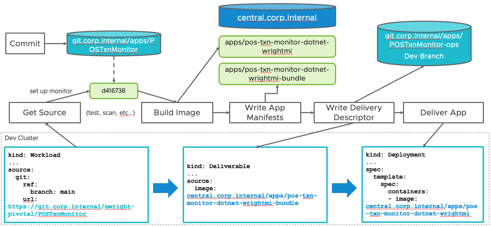
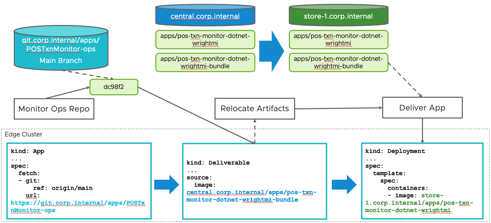

# Edge Delivery with Cartographer and Carvel
This repo captures an example of using Cartographer with Carvel to handle local delivery as well as remote cluster delivery with Image Package relocation.  These examples build on top of the [Tanzu Application Platform Out of the Box Supply Chain Basic](https://docs.vmware.com/en/VMware-Tanzu-Application-Platform/1.3/tap/GUID-scc-ootb-supply-chain-basic.html).  You will need to install the Tanzu Application Platform out of the box supply chains and dependencies for those supply chains to use this supply chain.

## Custom Container Image
This repo contains a customized container image used by Tekton to create an image lock file with `kbld` and `imgpkg` to store and relocate image bundles in the `imgpkg-container` folder.  You'll need to create and store this image in some repository that your clusters can reach.  You will also have to modify the `dc-supplychain/image-writer-lock.yaml` and `edge-delivery/source-template-image-relocate.yaml` to update the reference to your built image.

## Data Center Supply Chain

The central supply chain pipeline will test, scan source, build an image for your application with kpack (Tanzu Build Service), scan the image, store the image in a registry, generate deployment manifests for the application, store those manifests in an OCI image registry as an `imgpkg` bundle, store the `Deliverable` that references the bundle in a Git repo, and then applies the deliverable to the local build cluster.

As you can see, you will need to modify the supply chain file at `dc-supplychain/source-test-scan-to-url-edge.yaml` to have the proper information about the Git repo you want to use to store the generated `Deliverable` objects, and the OCI image registry to store the `imgpkg` bundles.

This supply chain monitors for `Workload` objects that include the following labels:
```
apiVersion: carto.run/v1alpha1
kind: Workload
metadata:
  labels:
    apps.tanzu.vmware.com/workload-type: server #or web, or worker
    se.tanzu.vmware.com/edge: "true"
...
```

You will need to create credentials for Git and the OCI image registry you want to push to in the namespaces that you create `Workload` objects.  You will want to follow the instructions at https://docs.vmware.com/en/VMware-Tanzu-Application-Platform/1.3/tap/GUID-set-up-namespaces.html and also add a Git SSH secret that you attach to the default service account in the namespace you are creating `Workload` objects in.  An example of a Git SSH secret is at `example-sa/git-ssh.yaml`.

You can modify the selector in `dc-supplychain/source-test-scan-to-url-edge.yaml` to change the selector for this supply chain.  

After you have the supply chain configured the way you want, you can apply it to your build cluster with `kubectl apply -f dc-supplychain`

## Edge ClusterDelivery


The edge cluster delivery watches for `Deliverable` objects and relocates the remote `imgpkg` bundle to a local registry, and deploys the `imgpkg` bundle from that local registry.

The Edge side ClusterDelivery expects a cluster that has at least a slimed version of the Tanzu Application Platform "Run" profile.  Here's an example "values" file you can use to install the slimmed profile to your cluster:
```
profile: run
ceip_policy_disclosed: true  # Installation fails if this is set to 'false'
supply_chain: basic

shared:
  ingress_domain: <your edge ingress domain, if any>

excluded_packages:
- cert-manager.tanzu.vmware.com  # only if your cluster already has cert-manager
- apis.apps.tanzu.vmware.com
- connector.appliveview.tanzu.vmware.com
- sso.apps.tanzu.vmware.com
- image-policy-webhook.signing.apps.tanzu.vmware.com
- cnrs.tanzu.vmware.com
- eventing.tanzu.vmware.com
- policy.apps.tanzu.vmware.com
- service-bindings.labs.vmware.com
- services-toolkit.tanzu.vmware.com
```

You will need to set up a namespace to monitor your central Git repo for deliverable objects using the instructions above for creating credentials in the build cluster supply chain.  Also, you will need to set up a kapp-controller `App` definition to watch for `Deliverable` objects to be commited to the GitOps repo.  If your GitOps repo is private, you'll need to add git credentials to your namespace default service account to access the repo.
